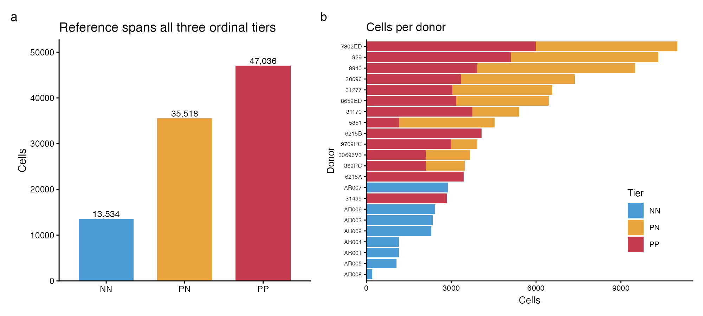
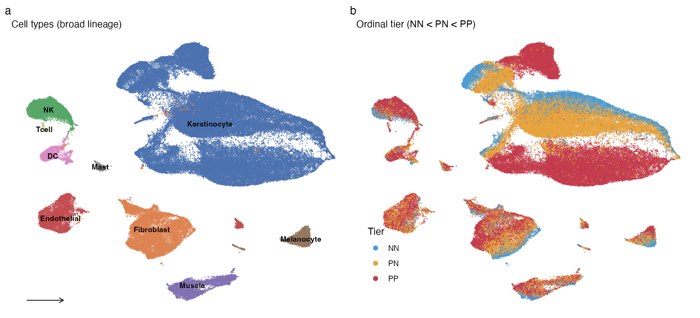
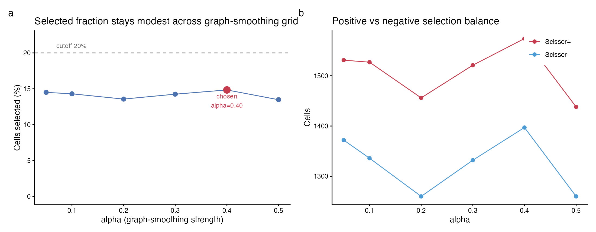
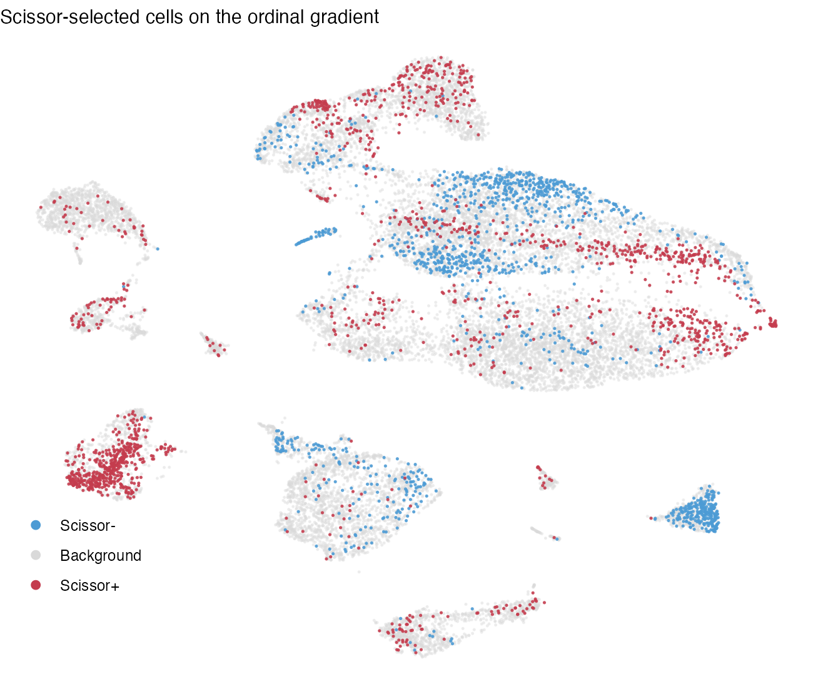
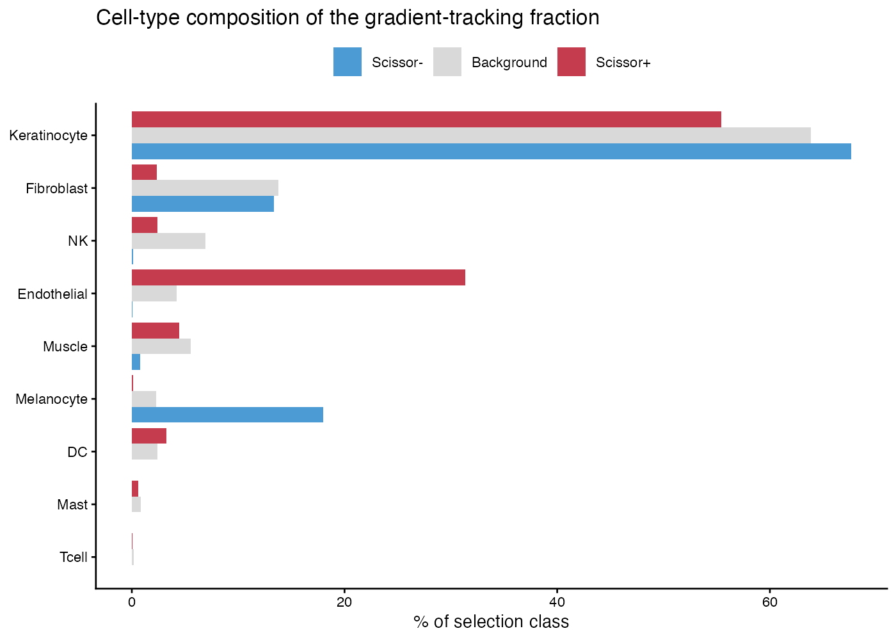
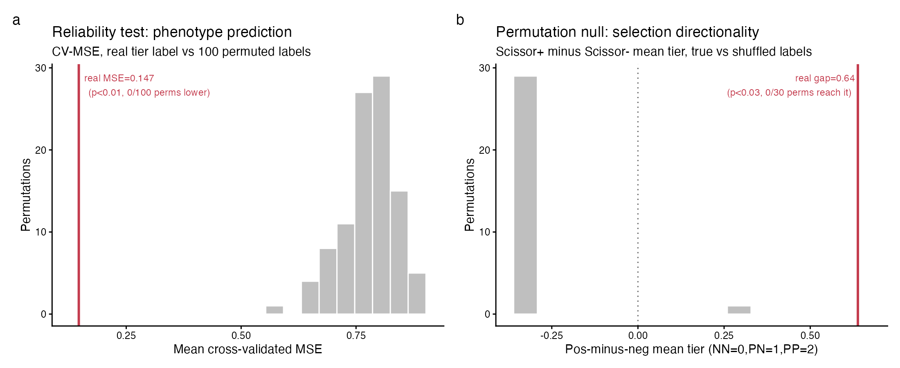
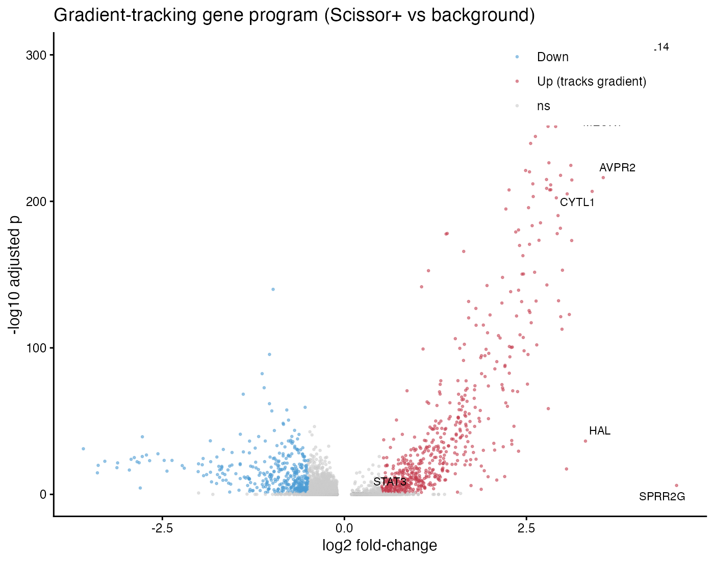
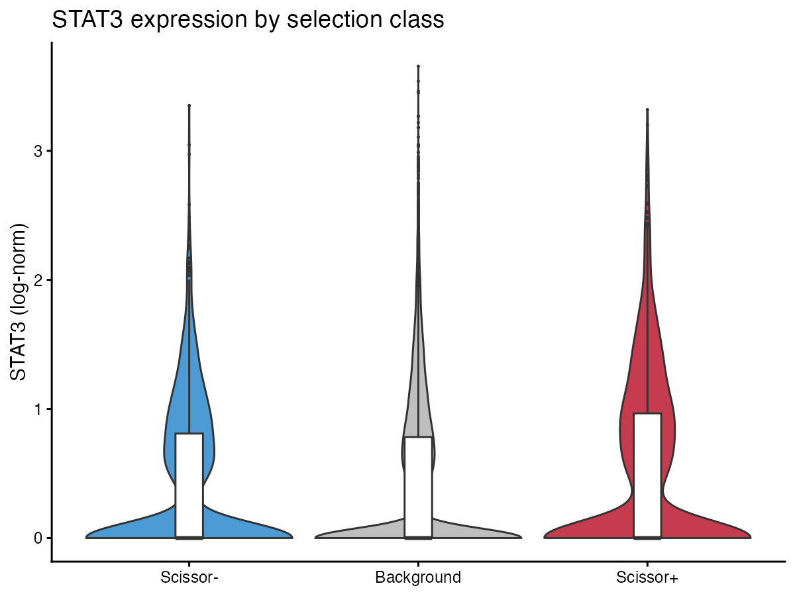
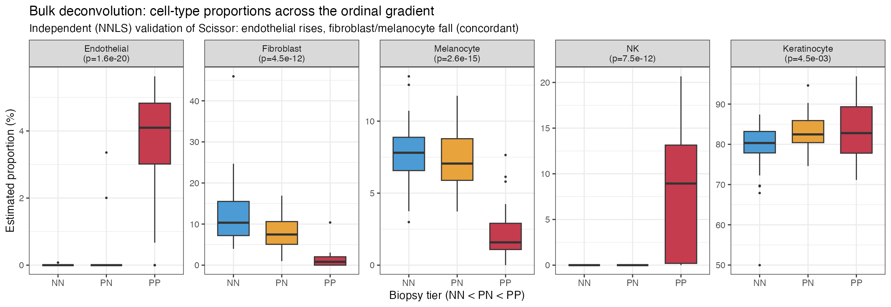

# Cell states that track the psoriasis progression gradient

**A Scissor analysis anchored on an ordinal biopsy-site phenotype (normal → peri-lesional → lesional)**

*Working draft white paper · project `psoriasis-1-bulk` · single-cell reference GSE173706 (Ma et al. 2023) · bulk anchor SRP165679 (Tsoi et al. 2019)*

---

## Abstract

Psoriatic skin is usually studied as a two-state contrast (lesional vs. normal), which discards the clinically meaningful *peri-lesional* margin where disease is actively expanding. We reframe the problem as an **ordinal gradient** — uninvolved (NN) < peri-lesional (PN) < lesional (PP) — and ask which single cells co-vary with that gradient. Using Scissor, we project an ordinal bulk RNA-seq phenotype (93 biopsies spanning all three tiers) onto an 89,058-cell single-cell reference that contains the peri-lesional compartment. Because the phenotype label is a clinical biopsy site rather than a molecular signature derived from the same cells, the mapping is **non-circular by construction**. Selected cells are monotonic on the gradient (mean tier: Scissor− 0.79 < background 1.38 < Scissor+ 1.43) and the gradient-tracking (Scissor+) fraction peaks at the peri-lesional tier. Both a reliability test (p = 0.000) and a selection permutation null (p = 0.000) confirm the signal is driven by real phenotype structure. Endothelial cells dominate the gradient-tracking population (5.2× enriched, OR 11.3), the associated 1,861-gene program is vascular-led, and STAT3 is a significant but modest member (log2FC 0.43, padj 0.018). An orthogonal bulk deconvolution independently confirms the compositional trend for the three strongest lineages. This document reports the validated laptop-scale **backbone**; the full-census run and additional robustness tiers are staged for cluster execution.

## 1  Background and rationale

Standard psoriasis transcriptomics contrasts lesional (PP) against uninvolved (NN) skin, and is blind to the **peri-lesional** zone (PN) — the advancing margin just outside the visible plaque, where the transition from health to disease is presumably underway. If a distinct program initiates psoriatic conversion, the peri-lesional compartment is where it should be visible, and a two-state design cannot see it.

We treat biopsy site as an **ordinal phenotype** (NN < PN < PP) and use **Scissor** (Sun, Guan, ... Xia, *Nat Biotechnol* 2021) to identify single cells whose expression co-varies with that gradient. The key design choice is that the phenotype is a **clinical biopsy-site label**, not a molecular score computed from the reference cells — so a flagged cell cannot be a restatement of how it was labelled. STAT3, a longstanding psoriasis candidate, is examined as a member of the resulting program, not assumed as a driver.

## 2  Data and design

### 2.1  Single-cell reference (GSE173706)
Assembled from 33 per-sample count matrices: **96,088 cells × 33,538 genes**, 22 donors, all three tiers (NN 13,534; PN 35,518; PP 47,036), with **11 donors contributing paired PN+PP biopsies**. After Ensembl→symbol mapping (24,185 symbols) and QC, **89,058 cells (92.7%)** were retained; standard clustering gave 23 clusters annotated to nine broad lineages.

*Single-cell reference composition (GSE173706, Ma et al. 2023). (A) Cells per biopsy tier after QC. (B) Cells per donor, stacked by tier; 11 donors contribute paired PN+PP biopsies.*

*Reference UMAP (89,058 cells). (A) Nine broad lineages by canonical markers. (B) Cells colored by tier — peri-lesional (PN) cells occupy an intermediate position between normal (NN) and lesional (PP).*

### 2.2  Bulk phenotype anchor (SRP165679)
Of five tier-labelled recount3 psoriasis studies, only **SRP165679 (Tsoi et al. 2019)** balances all three tiers at usable depth: **NN=38, PN=27, PP=28**. A single study removes cross-study confounding. Non-degeneracy checks pass: min tier size 27; bulk PC1 (27.8% variance) tracks the tier axis at **F=253.9, p ≈ 10⁻³⁸**.

| Check | Value |
|---|---|
| Tiers / min samples per tier | 3 / 27 |
| Bulk PC1 variance explained | 27.8% |
| Bulk PC1 ~ tier | F=253.9, p≈10⁻³⁸ |
| Cross-study confound | none (single study) |
| Phenotype circularity | none (clinical biopsy-site label) |

## 3  Method note: a portable Scissor solver

Scissor's selection is a graph-regularized elastic net solved by a compiled routine (APML1) that could not be built in our environment, so we reimplemented the identical objective in pure R on `glmnet`. The network penalty is the symmetric-normalized graph Laplacian `L_sym = I − D^(−1/2) A D^(−1/2)`; at ~10⁵ cells a dense Laplacian is intractable, so we encode it as a **sparse edge-difference augmentation** (one sparse row per graph edge). Sparsity is controlled by walking the glmnet λ-path to a target selected fraction. On synthetic two-community data the port recovered 100/100 true-positive cells (cor(β,β_true)=0.72). This is a validated equivalent, **not** the canonical solver; a cross-check against compiled Scissor is staged for the cluster.

## 4  Results

### 4.1  Selection and directionality
The backbone runs on a **stratified 20,023-cell subset** (full census staged for cluster). Tuning gave **alpha=0.40, 14.84% of cells selected** (1,574 Scissor+, 1,397 Scissor−). Selected cells are **monotonic on the gradient**: mean tier Scissor− **0.79** < background **1.38** < Scissor+ **1.43**, and the Scissor+ fraction **peaks at the peri-lesional tier** (9.4% of PN cells vs. 8.0% of PP) — the signature of an intermediate progression state.

*Scissor alpha tuning. Selected fraction across the graph-smoothing grid; alpha=0.40 was chosen (14.84% selected, under the 20% cutoff).*

*Scissor selection on the reference UMAP (20k subset). Scissor+ (gradient-tracking, lesional-associated), Scissor- (normal-associated), and background cells.*

*Cell-type and tier composition of the Scissor-selected fractions. Scissor+ peaks at the PN/peri-lesional tier.*

### 4.2  Significance
The **reliability test** (100 label permutations) gives real CV-MSE **0.147** vs. null mean **0.779** (**p = 0.000**). The **selection permutation null** (30 shuffled-label reruns) collapses the positive-minus-negative tier gap from real **0.638** to null mean **−0.305** (**p = 0.000**). The selection reflects real phenotype structure, not graph geometry.

*Significance controls. (A) Reliability test: real CV-MSE vs 100 label permutations. (B) Selection permutation null: real pos-minus-neg tier gap vs 30 shuffled-label reruns.*

### 4.3  Which cells track the gradient

| Cell type | Fold in Scissor+ | Odds ratio | p | Interpretation |
|---|--:|--:|--:|---|
| Endothelial | 5.18× | 11.26 | 6×10⁻²⁴⁵ | lesional-tracking |
| DC | 1.40× | 1.47 | 0.014 | weakly lesional |
| Keratinocyte | 0.87× | 0.69 | 8×10⁻¹² | near-uniform |
| NK | 0.40× | 0.36 | 2×10⁻¹² | depleted from Scissor+ |
| Fibroblast | 0.18× | 0.15 | 5×10⁻⁵³ | normal-tracking |
| Melanocyte | 0.04× | 0.04 | 3×10⁻²⁰ | normal-tracking |

### 4.4  The gradient-tracking gene program
Scissor+ vs. background DE yields **1,861 genes at padj < 0.05**; top up-regulated genes are vascular/endothelial (**CCL14, ACKR1, RAMP3, PLVAP, APLNR, CYTL1, SPNS2**). **STAT3** is significant (**log2FC 0.43, padj 0.018**) but modest — the program is vascular-led, not STAT3-led.

*Gradient-tracking gene program: volcano of Scissor+ vs background differential expression (1,861 genes at padj<0.05).*

*STAT3 expression across Scissor classes: significantly elevated in Scissor+ (log2FC 0.43, padj 0.018).*

### 4.5  Orthogonal validation by bulk deconvolution
NNLS deconvolution of the real SRP165679 bulk, tested for monotonic proportion trends across NN→PN→PP:

| Cell type | Scissor direction | Bulk proportion trend | padj | Status |
|---|---|---|--:|---|
| Endothelial | lesional-tracking | rises 0.0→0.2→3.8% | 1×10⁻¹⁹ | ✓ concordant |
| Fibroblast | normal-tracking | falls 12.3→8.2→1.4% | 1×10⁻¹¹ | ✓ concordant |
| Melanocyte | normal-tracking | falls 7.8→7.3→2.2% | 1×10⁻¹⁴ | ✓ concordant |
| NK | normal-tracking | rises to 7.9% (PP) | 2×10⁻¹¹ | ✗ discordant |
| Keratinocyte | normal-tracking | rises 79→83→83% | 5×10⁻³ | ✗ discordant |
| DC | lesional-tracking | flat | 0.20 | trend n.s. |

The three strongest-signal lineages are concordant: the endothelial signal reflects a **real compositional increase** in bulk tissue. Discordant cases are informative — NK cells *infiltrate* lesional tissue (bulk fraction rises) yet individual NK cells are depleted from the per-cell gradient-tracking set; keratinocytes dominate every tier. Per-cell tracking and bulk composition are different measurements that converge on clean compositional shifts and diverge otherwise.

*Orthogonal bulk deconvolution vs Scissor direction, by cell type. Endothelial (lesional-tracking), Fibroblast and Melanocyte (normal-tracking) are concordant; NK and Keratinocyte discordant; DC non-significant.*

## 5  Discussion
The reframing yields a coherent, reproducible signal: a gradient-tracking population that is monotonic on NN→PN→PP, peaks at the peri-lesional margin, survives two orthogonal significance controls, and is corroborated by bulk deconvolution. The dominant biology is **vascular** — endothelial expansion and an angiogenic program — consistent with the histology of psoriatic progression and directing attention to the dermal vasculature at the advancing edge, not only the epidermal keratinocyte compartment. STAT3 participates in the expected direction but is not the driver; any role appears embedded in a broader vascular/inflammatory circuit.

## 6  Limitations
- **Backbone scale** — 20,023-cell subset; full census staged for cluster (directionality expected to hold).
- **Solver** — validated pure-R reimplementation, not compiled APML1; cross-check planned.
- **Single bulk anchor** — Tier-1 uses SRP165679 only.
- **Deconvolution method** — transparent NNLS, not a benchmarked choice.

## 7  Next steps
1. Full-census run (89,058 cells) on the cluster.
2. Compiled-Scissor cross-check.
3. Benchmarked deconvolution (deconvBenchmarking).
4. Robustness tiers — additional bulk anchors / tier definitions.
5. Sequence-level arm (Sei-LLRA / seillra) — score regulatory variants near gradient-program genes; STAT3 sits at the seam between expression and sequence arms.

## 8  Data and code availability
Single-cell reference **GSE173706** (Ma et al. 2023); bulk anchor **SRP165679** (Tsoi et al. 2019, via recount3). All code, figures, tables, environment spec, and this white paper are in `github.com/soahum-b/psoriasis-1-bulk`; reproduce/scale instructions in `HANDOFF.md`. Heavy inputs regenerate via `code/00_download_data.R`.

**Method reference.** Scissor: Sun D, Guan X, Moran AE, et al. Identifying phenotype-associated subpopulations by integrating bulk and single-cell sequencing data. *Nature Biotechnology* **40**, 527–538 (2021). doi:10.1038/s41587-021-01091-3.

---
*Working draft — internal white paper. All quantitative values computed from the saved analysis artifacts. Clinical interpretation is preliminary and not intended to guide patient care.*
